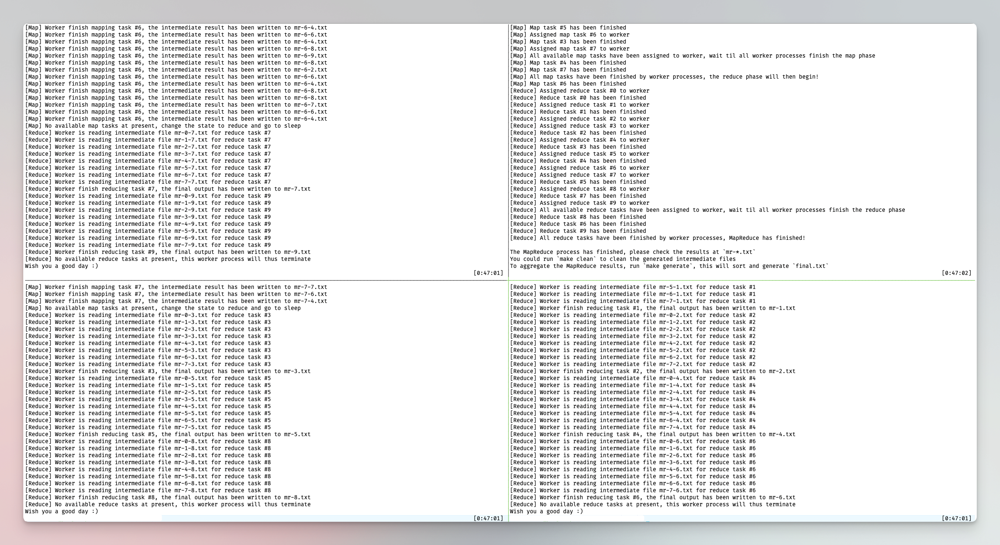

> ### For the single-threaded MapReduce implementation, please check the `single-thread` branch.

## This is a distributed, fault-tolerant, reliable, simplified and easy-to-learn MapReduce framework written in Rust.
- The user runtime is using `tokio`, an asynchronous runtime for Rust, make it efficient under I/O-Bound scenario like MapReduce
- The RPC framework is using `tarpc`, nodes will communicate through `TCP` connection
- You may start the MapReduce process with **one** `Coordinator` & **multiple** `Worker(s)`, the number of worker processes can be specified by users
- The default application is a word count application, which will use the provided `pg-*.txt` files under the `resource` directory to count the total words and the corresponding frequency
- You can define your own map reduce function in `src/mr/function.rs` & `src/mr/worker.rs`, see the comment for details
- You may want to change the `server_address` to adapt to your environment, check `src/bin/mrcoordinator.rs` & `src/bin/mrworker.rs` for details
- If one or more `Worker(s)` crash(es) during the MapReduce process, the `fault-tolerant` mechanism (By maintaining the heartbeat-like, leases of each tasks to allow the `Coordinator` detect if any of the `Worker` has gone offline) will allow the MapReduce continue progressing, also ensure the correctness
- If the `Coordinator` crashes during the MapReduce process, the `Worker(s)` will wait for the restart of the `Coordinator`, and the recovery process will be triggered by the underlying `Write Ahead Log` on the `Coordinator` side

## To run the program, follow the instructions:
- Please make sure you are in the `src` directory, if not (Assumes you are in the root directory), run `cd src`
- If you want to start the MapReduce in default version, just run `bash start.sh` or `zsh start.sh` or other command to run the script, depending on your own environment. To stop the MapReduce process, run the `stop.sh` in the same way. If permission is denied, run `chmod -x <script name>` to grant permission
- You can start the `Coordinator` by running `cargo run --bin mrcoordinator -- <map tasks number> <reduce tasks number> <worker number>`
- Then start one or more `Worker(s)` in **different** terminal windows by running `cargo run --bin mrworker <map tasks number> <reduce tasks number>`, please make sure the server has been started before you starts the `Worker`
- The number of `Worker(s)` should exactly match with the specified number when you started the server, otherwise the MapReduce process either will hang (The `Worker(s)` is not enough) or will panic (The `Worker(s)` exceed the preset limit)
- To check the final result, first run `make clean`, this will clean all intermediate files, then running `make generate` to generate the sorted `final.txt`, feel free to change anything in the provided `Makefile` to best fit your taste!

## Result Image

A typical MapReduce result will probably look like the following image, the `Coordinator` (The upper right one) is running with `cargo run --bin mrcoordinator -- 8 10 3` and three other `Workers` with `cargo run --bin mrworker -- 8 10`, respectively.

## TODO:
- Garbage collector
- Improve logging method, add different logging level
- Parallel processing for each worker, i.e., utilize `rayon` to achieve parallel data processing
- Better serialization & deserialization format especially for intermediate files
- More test cases to ensure the overall correctness & the test cases coverage